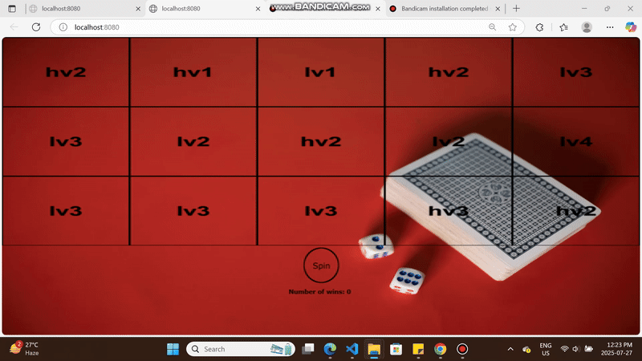

# Table of Contents

1. [About the project](#about-the-project)
   - [Built with](#built-with)
2. [Getting started](#getting-started)
   - [Prerequisites](#prerequisites)
3. [Acknowledgements](#acknowledgements)
4. [Improvements](#improvements)

## About the project

### 1. Write a basic slot machine game in javascript using pixi.js

Write a game in ECMAScript 6th edition (https://en.wikipedia.org/wiki/ECMAScript#ES2015) using pixi.js (https://pixijs.com/) or phaser (https://phaser.io/) that simulates a basic slot machine. The screen should display a 5 columns by 3 rows reels, a spin button below the reels and a text area below to display the wins. Elements should be centered in the screen and the game area containing the elements should rescale with window resizes.

All images that will be used in the game should priorly be loaded in a preloader screen. The preloader screen should display the percentage of the assets that are loaded in a PIXI.Text, text should be centered in the screen.

_- loading assets, staging, centering (https://pixijs.com/8.x/tutorials/getting-started#2) _

To display the symbols on the reels, use PIXI.Sprite with the symbol images provided.

For the spin button, use the circle button image provided. When pressing the spin button, the reels positions should be picked randomly and the symbols be updated on the screen. No spinning animation is required.

To determine the visible symbols, use this reelset bands description:

Reelset:

- Band 1: "hv2", "lv3", "lv3", "hv1", "hv1", "lv1", "hv1", "hv4", "lv1", "hv3", "hv2", "hv3", "lv4", "hv4", "lv1", "hv2", "lv4", "lv1", "lv3", "hv2"
- Band 2: "hv1", "lv2", "lv3", "lv2", "lv1", "lv1", "lv4", "lv1", "lv1", "hv4", "lv3", "hv2", "lv1", "lv3", "hv1", "lv1", "lv2", "lv4", "lv3", "lv2"
- Band 3: "lv1", "hv2", "lv3", "lv4", "hv3", "hv2", "lv2", "hv2", "hv2", "lv1", "hv3", "lv1", "hv1", "lv2", "hv3", "hv2", "hv4", "hv1", "lv2", "lv4"
- Band 4: "hv2", "lv2", "hv3", "lv2", "lv4", "lv4", "hv3", "lv2", "lv4", "hv1", "lv1", "hv1", "lv2", "hv3", "lv2", "lv3", "hv2", "lv1", "hv3", "lv2"
- Band 5: "lv3", "lv4", "hv2", "hv3", "hv4", "hv1", "hv3", "hv2", "hv2", "hv4", "hv4", "hv2", "lv2", "hv4", "hv1", "lv2", "hv1", "lv2", "hv4", "lv4"

The initial position of the reels should be:

    Positions: 0, 0, 0, 0, 0
    Screen:
      hv2 hv1 lv1 hv2 lv3
      lv3 lv2 hv2 lv2 lv4
      lv3 lv3 lv3 hv3 hv2

Here is an example of some positions and the symbols that should be displayed on the screen:

    Positions: 18, 9, 2, 0, 12
    Screen:
      lv3 hv4 lv3 hv2 lv2
      hv2 lv3 lv4 lv2 hv4
      hv2 hv2 hv3 hv3 hv1

### 2. Next, implement the winnings calculation for the following paytable:

     Symbol id | 3 of a kind | 4 of a kind | 5 of a kind
    -----------|-------------|-------------|-------------
         hv1   |      10     |      20     |      50
    -----------|-------------|-------------|-------------
         hv2   |      5      |      10     |      20
    -----------|-------------|-------------|-------------
         hv3   |      5      |      10     |      15
    -----------|-------------|-------------|-------------
         hv4   |      5      |      10     |      15
    -----------|-------------|-------------|-------------
         lv1   |      2      |      5      |      10
    -----------|-------------|-------------|-------------
         lv2   |      1      |      2      |      5
    -----------|-------------|-------------|-------------
         lv3   |      1      |      2      |      3
    -----------|-------------|-------------|-------------
         lv4   |      1      |      2      |      3
    -----------|-------------|-------------|-------------

The pay lines always pay from left to right, starting on the first, left-most column. You should check for winning combinations on the following lines (x represents a symbol match position on the pay line):

     Pay line id | visual description
    -------------|--------------------
                 |      - - - - -
          1      |      x x x x x
                 |      - - - - -
    -------------|--------------------
                 |      x x x x x
          2      |      - - - - -
                 |      - - - - -
    -------------|--------------------
                 |      - - - - -
          3      |      - - - - -
                 |      x x x x x
    -------------|--------------------
                 |      x x - - -
          4      |      - - x - -
                 |      - - - x x
    -------------|--------------------
                 |      - - - x x
          5      |      - - x - -
                 |      x x - - -
    -------------|--------------------
                 |      x - - - x
          6      |      - x - x -
                 |      - - x - -
    -------------|--------------------
                 |      - - x - -
          7      |      - x - x -
                 |      x - - - x

The winnings should be displayed in a multiline PIXI.Text. Winnings should first display the total wins then win details should be listed sequentially. Each entry should display the payline id, the symbol id, the number of symbols matching and the payout. The winnings text should be scaled to fit in the available viewport space below the spin button, it shouldn't overflow outside of the viewport.

Here is an example of a complete result with wins:

    Positions: 0, 11, 1, 10, 14
    Screen:
      hv2 hv2 hv2 lv1 hv1
      lv3 lv1 lv3 hv1 lv2
      lv3 lv3 lv4 lv2 hv1
    Total wins: 6
    - payline 2, hv2 x3, 5
    - payline 5, lv3 x3, 1

And here's another example:

    Positions: 0, 0, 0, 0, 0
    Screen:
      hv2 hv1 lv1 hv2 lv3
      lv3 lv2 hv2 lv2 lv4
      lv3 lv3 lv3 hv3 hv2
    Total wins: 1
    - payline 3, lv3 x3, 1

_ Bonus _
\_1. animation for reels change (https://pixijs.com/8.x/tutorials/getting-started#3)

### built with

 

## Getting Started

Clone the project to your local directory with the following command
git clone https://nikinajafi@bitbucket.org/pearfiction/front-end-dev-assignment-niki-najafi.git  Then open the project in your preferred IDE like VScode.

### Run the project

1. Download Node.js from https://nodejs.org/en
2. Update Node.js to the latest version  
   `npm install npm@latest -g`
3. Navigate to the project's directory and install the dependencies that are listed in the package.json file using:
   `npm install` command in the IDE's terminal window.
4. Run the command `npm start` to start the project.

## Acknowledgements

- https://pixijs.com/8.x/tutorials/getting-started#1
- https://github.com/gamedevland/pixi-project-template/tree/main/src/scripts
- https://www.youtube.com/watch?v=oZInrjsClPg

## Improvements
### 1. Static vs. Dynamic Data Separation
Separated immutable configuration (symbols, paylines, payout tables) into `Config.js` and mutable runtime state (reel positions, updated matrices, scores) into `GameState.js`.  
This keeps the codebase organized and prevents accidental overwriting of constants.

### 2. Optimized Data Structures
Restructured `Reelset`, `Payline`, and `Paytable` for better readability and faster processing.  
This makes win calculations and reel updates cleaner and more maintainable.

### 3. Dependency Injection for Flexibility
Introduced Dependency Injection, passing dependencies like `GameState`, `Config`, and `spriteFactory` into constructors (`Reel`, `ScoreLogic`, `PlayAndTrack`).  
This approach improves modularity, simplifies testing, and allows future feature expansion.

### 4. Accurate Scoring System
Rebuilt the scoring logic to track **total wins per spin** as well as detailed line-by-line payouts.  
Now displays a proper breakdown, e.g.:  

### 5. Refined Folder Structure
Reorganized the project into logical sections:
- `core/` for the core app and setup  
- `config/` for configuration and state  
- `world/` for game objects (Reel, etc.)  
- `ui/` for interface elements (buttons, labels)  
- `managers/` for managing gameplay
This improves scalability and keeps related logic together.

### 6. Slot Machine Reel Animation (Bonus)
Added a **smooth, slot-machine-like reel animation** using PixiJS’s `ticker`.  
Reels now spin with staggered stop timing, creating a natural slot machine effect for a more engaging player experience.

### 7. Instant Window Resize Responsiveness
The interface now adjusts dynamically to window size changes without requiring a page reload.

### 8. Unit Test Coverage
Comprehensive unit tests have been added, ensuring all major game components are validated for functionality and reliability.

